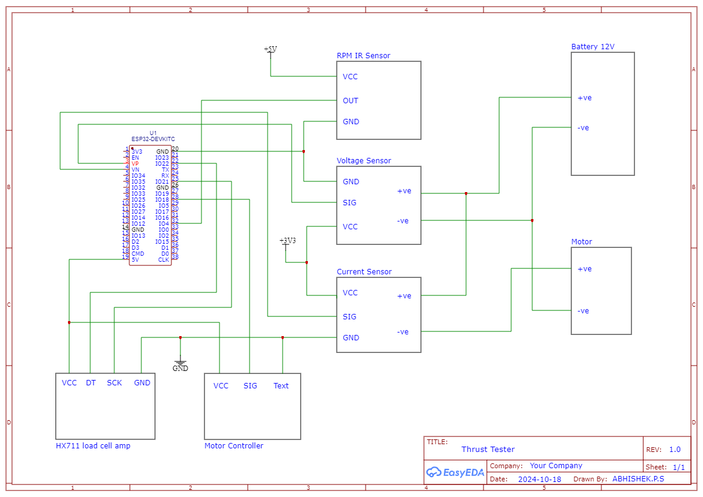

# ESP32 Thrust Testing System

This project demonstrates an ESP32-based thrust testing system for evaluating the performance of a motor with live data like thrust, voltage, current, power, RPM, and efficiency. The system displays data in real-time through a web interface and supports saving the recorded data for analysis.

## Features

- Real-time data collection (Thrust, Voltage, Current, RPM, Power, Efficiency)
- Web interface to control throttle and view sensor data
- WiFi-enabled data visualization with live charts
- Adjustable throttle control for motor testing
- Load cell calibration for accurate thrust measurements

## Components Used

- ESP32 (microcontroller)
- HX711 Load Cell Amplifier
- Load Cell (to measure thrust)
- Voltage Sensor
- Current Sensor (ACS712)
- Servo Motor (to control throttle)
- Hall Effect Sensor for RPM measurement
- Resistors (for voltage divider in voltage sensing circuit)

## System Overview

The system collects data from the sensors and processes it on the ESP32. The real-time sensor data is served via a web interface, allowing users to visualize the thrust, voltage, current, power, RPM, and efficiency values over time. The throttle is controlled through a servo motor that can be adjusted from the web interface.

## Circuit Diagram



The Circuit diagram outlines the system components and their connections.

## Installation

### 1. Clone the Repository

```bash
git clone https://github.com/psabhishek26/esp32-thrust-tester.git
cd esp32-thrust-tester
```
### 2. Upload Code to ESP32

- Install the required libraries:
  - `HX711`
  - `ArduinoJson`

To install these libraries:
  1. Open Arduino IDE.
  2. Go to **Sketch** > **Include Library** > **Manage Libraries**.
  3. Search and install the above-mentioned libraries one by one.

- Open the code in the Arduino IDE or PlatformIO and upload it to the ESP32:
  1. Download and open the `.ino` file in your Arduino IDE.
  2. Connect your ESP32 board to your computer.
  3. Select your board and the correct COM port under **Tools** in the Arduino IDE.
  4. Click **Upload** to flash the code to your ESP32.

### Circuit Connections

Follow the circuit diagram to connect all the components to the ESP32.

| **Component**       | **Pin**       |
|---------------------|---------------|
| HX711 DT Pin        | GPIO 22       |
| HX711 SCK Pin       | GPIO 21       |
| Voltage Sensor      | GPIO 36       |
| Current Sensor      | GPIO 39       |
| RPM Sensor          | GPIO 4        |
| Servo Control Pin   | GPIO 18       |

### 4. Web Interface and Data Visualization

Once the code is uploaded and ESP32 is running, connect to the WiFi network provided by ESP32.

#### Steps:
1. Connect to the WiFi network:  
   SSID: `espthrust`  
   Password: `12345678`
   
2. Open a browser and enter the ESP32's IP address (printed in the Serial Monitor).  
   This will load the web interface where you can:
   - Start and stop sampling.
   - Adjust the throttle.
   - View real-time data (thrust, voltage, current, power, RPM, efficiency) on graphs.
   - Save or print the collected data.

### Usage

- **Adjusting the Throttle**:  
  Use the throttle slider to change the throttle value between 1000 to 2000 microseconds (µs) and observe how it affects thrust and other parameters in real time.

- **Start/Stop Sampling**:  
  - Press **Start Sampling** to begin data collection.
  - Press **Stop Sampling** to stop the data collection and view the saved data in a table format.

- **Data Visualization**:  
  The web interface displays real-time sensor data in graphs:
  - Thrust (g)
  - Voltage (V)
  - Current (A)
  - Power (W)
  - RPM
  - Efficiency (g/W)

